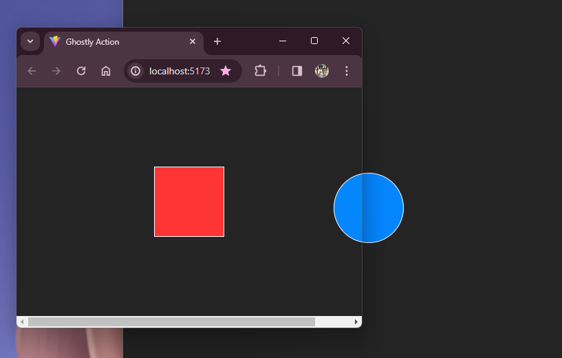

# Ghostly Action ✨

This is a practice project using as template my [window-communication repo](https://github.com/SantiagoCode/window-communication), serving as an exploration of interesting concepts.

## Description 👀

This app creates a localization effect of the second element according to its position in the opposite window. It supports a maximum of two windows.

## Screenshot 💻




## Run Locally 🚀

Clone the project

```bash
  git clone https://github.com/SantiagoCode/vanilla-practice.git
```

Go to the project directory

```bash
  cd ghostly-window
```

Install dependencies

```bash
  npm install
```

Start the server

```bash
  npm run dev
```

## Author

- [@SantiagoCode](https://www.github.com/SantiagoCode) 😉